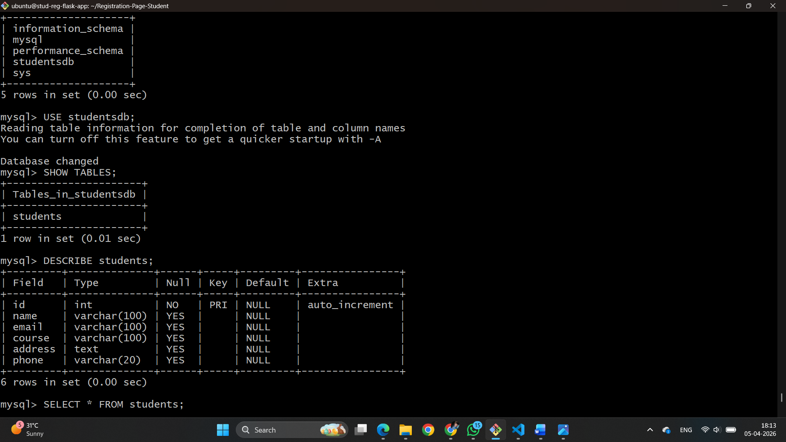

# Registration-Page-Student  Flask-Based Student Registration Web Application (CI/CD with Jenkins)

## 📌 Project Title
Flask-Based Student Registration Web Application deployed using Jenkins

---

## 📖 Project Overview
This project is a Flask-based web application that allows users to register students through a web form. The data is stored in a MySQL database and can be viewed in a tabular format. The project is integrated with Jenkins for CI/CD automation.

---

## ⚙️ Tech Stack
- Frontend: HTML, CSS
- Backend: Python (Flask)
- Database: MySQL
- Version Control: Git & GitHub
- CI/CD Tool: Jenkins
- Server (Optional): AWS EC2 / Ubuntu

---
## Architecture Diagram


## 🚀 Features
- Student Registration Form
- Input Validation (basic)
- Store data in MySQL database
- Display all registered students
- Success/Failure messages
- Jenkins automated build & deployment

---

## 📁 Project Structure

```
stud-reg-flask-app/
│
├── app.py
├── requirements.txt
├── Jenkinsfile
│
├── templates/
│ ├── index.html
│ └── students.html
│
├── static/
│ └── style.css
│
└── README.md

```

---

## 🛠️ Setup Instructions

### 1. Clone Repository
```bash
git clone https://github.com/uttamzure/stud-reg-flask-app.git

cd stud-reg-flask-app
```

### 2. Create Virtual Environment
```
python3 -m venv venv

source venv/bin/activate
```

### 3. Install Dependencies
```
pip install -r requirements.txt
```
### 4. Setup MySQL Database

```
CREATE DATABASE studentsdb;

USE studentsdb;

CREATE TABLE students (
    id INT AUTO_INCREMENT PRIMARY KEY,
    name VARCHAR(100),
    email VARCHAR(100),
    phone VARCHAR(20),
    course VARCHAR(50),
    address TEXT
);
```
### 5. Run Flask Application

```
python3 app.py
```

### Open browser:
```
http://54.67.56.41:5000/
```
### Jenkins CI/CD Pipeline
Jenkinsfile
```
pipeline {
    agent any

    stages {
        stage('Test Stage') {
            steps {
                echo 'Pipeline is working'
            }
        }

        stage('Clone Code') {
            steps {
                git 'https://github.com/uttamzure/Registration-Page-Student.git'
            }
        }

        stage('Install Dependencies') {
            steps {
                sh 'pip3 install -r requirements.txt'
            }
        }

        stage('Run App') {
            steps {
                sh 'nohup python3 app.py > app.log 2>&1 &'
            }
        }
    }
}
```


# Screenshots

## 1. Home Page (Registration Form)

.png)

## 2. ALL Fields Are Required (Registration Form)
.png)

## 3. Students List Page


## 4. MySQL Database Table



## 6. Jenkins Build Success
.png)
.png)

## 7. Flask Running in Terminal


---

##  Future Improvements

* Add user authentication (login system)
* Implement update & delete functionality
* Use REST API architecture
* Docker containerization
* Deploy on AWS EC2 with Nginx
* Improve UI with Bootstrap

---
---

## License

This project is for educational purposes.